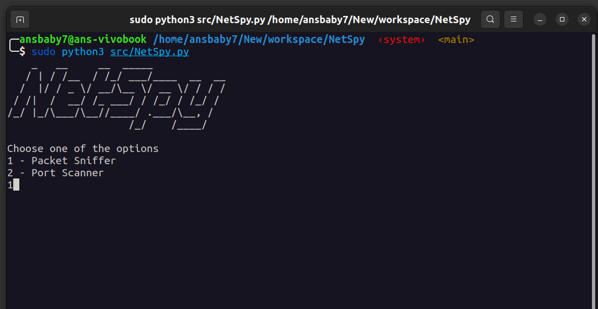
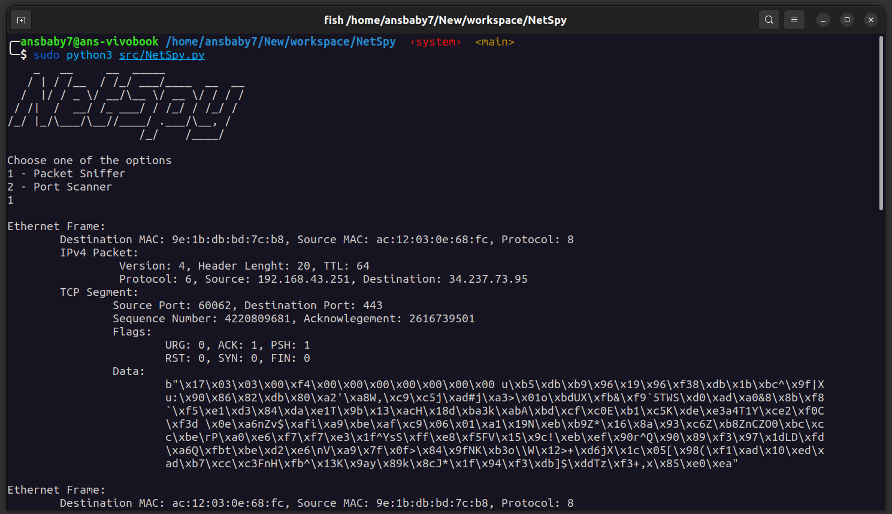
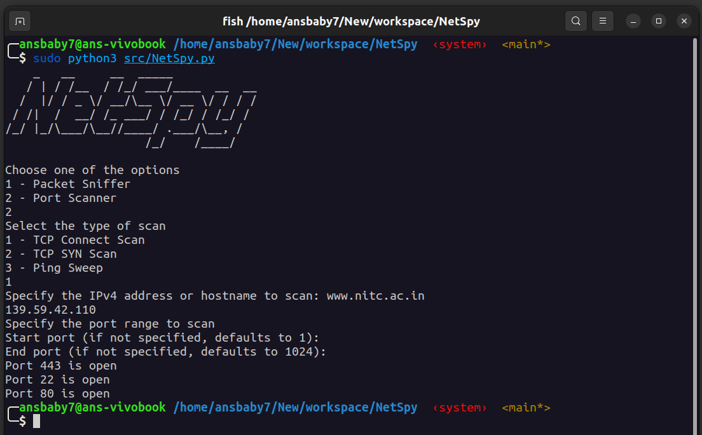
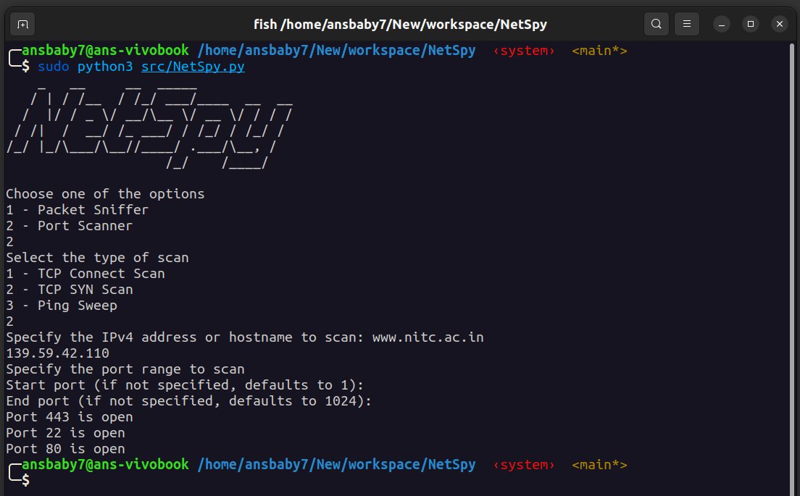
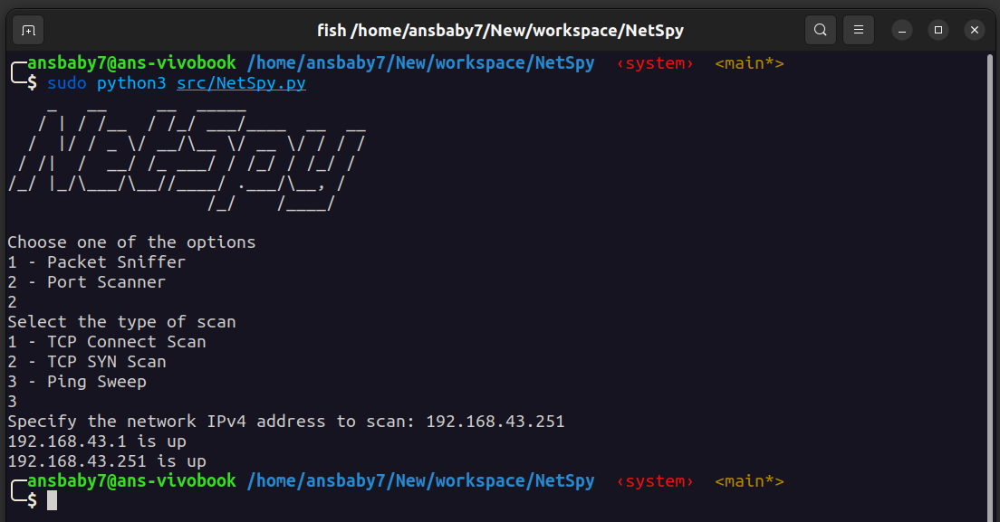

# NetSpy

## Requirements

- A Linux system
- Python 3.x
- Scapy (Refer [https://scapy.readthedocs.io/en/latest/installation.html](https://scapy.readthedocs.io/en/latest/installation.html))

## Setup/Installation

- Open a terminal

- Clone the project repository by running
  
    `git clone https://github.com/ansbaby7/NetSpy.git`
  
    [Note: You need to have git installed to run this command]

- Run the program using the command `sudo python3 src/NetSpy.py`

## Using the Packet Analyzer module

## Using the Port Scanner module

1. **TCP Connect Scan**

2. **TCP SYN Scan**

3. **Ping Sweep Scan**

Note: This scan currently supports only mask of /24 (CIDR)

